# 1. Project Title:

      Smart Employee and Project Management System.

--------------------------------------------------------------------------------------------------------------


# 2. Description

The Smart Employee & Project Management System is a premium, web-based productivity application designed for modern organizations to track projects, assign tasks, and manage team members on a collaborative Kanban board. Built for system administrators, project managers, and employees, it simplifies workspace management by offering real-time progress tracking, interactive status boards, and secure user profile management. It is utilized to streamline team workflows, ensure operational transparency with comprehensive audit logging, and generate downloadable reports in PDF and Excel formats.


--------------------------------------------------------------------------------------------------------------


# 3. 🚀 Technology Stack

- **Programming Languages**: Java 17, JavaScript (ES6+), HTML5, CSS3 (Vanilla CSS).
- **Backend Framework**    : Spring Boot 3.x (with Spring Data JPA, Spring Security, and Jakarta Validation).
- **Frontend Library**     : React (JS) 19.x served via Vite.
- **State Management**     : Zustand (Stateless client token storage).
- **Security & Auth**      : stateless JSON Web Tokens (JWT) with dynamic verification.
- **Databases**            : MySQL 8.x (Primary relational database), H2 Database (for in-memory testing).
- **Reporting Utilities**  : Apache POI (Excel generation), OpenPDF (PDF generation).


--------------------------------------------------------------------------------------------------------------


# 4. 🔑 Default Credentials

To access the system, you can use the default Admin account or register your own accounts.

- **Admin Username**: `admin@company.com`
- **Admin Password**: `Admin@123`


--------------------------------------------------------------------------------------------------------------


# 5. Prerequisites

  **Operating System**          : Windows 10/11, macOS, or Linux.
  **Java Development Kit (JDK)**: Version 17.
  **Node.js & npm**             : Node.js v18.x or v20.x+ (with npm 9.x+).
  **Database**                  : MySQL Server 8.0+ running on port 3306 (or Docker Desktop installed for  containerized deployment).
  **Port Availability**         : Ports 80 (or 5173 for dev) and 8080 must be free on localhost.


--------------------------------------------------------------------------------------------------------------


# 6. 🛠️ Installation & Dependency commands 

**Natively (Local Machine)**
  Run the following commands in your terminal to set up and download all dependencies:

  1. Clone the repository
        ``` 
        git clone https://github.com/PavanKumar111111/Smart_Employee_and_Project_Management_System.git
        cd Smart_Employee_and_Management_System

        ```
  2. Setup the MySQL database schema

      ```
        mysql -u root -p < schema.sql
      ```

  4. Download backend dependencies and compile
   
    ```
        cd smartep
        ./mvnw.cmd clean compile
    ```
  4. Download frontend node packages

    ```
        cd ../frontend
        npm install
    ```

**Via Docker (One-Command Deployment)**
  If you prefer running the entire stack inside containers without installing JDK or Node.js locally:

  1. Navigate to the project root and start all services
   
    ```
        docker compose up --build -d

     ```


--------------------------------------------------------------------------------------------------------------


# 7. 🎨 Key Features

    1. **Interactive Kanban Task Board**
       The drag-and-drop Kanban board allows team members to seamlessly move tasks between "To Do", "In Progress", "In Review", and "Done" columns. It dynamically updates project completion percentages in real time to keep everyone aligned on progress.
    2. **Administrative Employee Directory**
       Administrators can manage the complete lifecycle of employees, including onboarding, role assignments, department allocation, and status toggles. The directory features search filters and sorting options to make managing large teams efficient.
    3. **Role-Based Access Control (RBAC)**
       Secured by stateless JWT authentication, the system restricts project modifications and deletions strictly to users with the ADMIN role. Regular EMPLOYEE users are granted access to update their task progression on the Kanban board.
    4. **Pale Green Completed Project Highlighting**
       Projects that are marked as completed automatically render with a pale green background card in the Admin Portal and green table rows on the Dashboard. This visual indicator provides managers with an instant overview of finished milestones.
    5. **Interactive Profile Photo Management**
       Employees can view their read-only profile details and upload a new profile picture by clicking their avatar in the dashboard or navigation header. The backend strictly ensures that non-admin employees can only update their own photos.
    6. **Comprehensive System Audit Logging**
       The application automatically records critical system actions—such as registration, login attempts, project creations, and photo uploads—in a central audit database. This provides administrators with full operational traceability and compliance logs.
    7. **PDF, CSV and Excel Report Generation**
       Users can instantly export formatted project performance metrics and task distribution details to download tables. The system utilizes Apache POI and OpenPDF to deliver professional sheets and documents.
    8. **Containerized Docker Deployment**
       The entire system, including the MySQL database, Spring Boot API, and Nginx-served frontend, is packaged using a multi-stage Docker Compose file. This enables you to deploy the complete environment on any machine with a single command.
    9. **👥 Admin Employee Impersonation**
       Administrators can securely log in as any employee by sending a POST request to the restricted /api/admin/employees/{id}/impersonate endpoint. The backend automatically audits the event and issues a valid JWT token representing that employee's principal, allowing administrators to view and test the dashboard exactly as that user would.
    10. **✉️ Email OTP Password Reset**
       Users can request a password reset via the /api/auth/forgot-password endpoint, which generates a secure, one-time 6-digit verification code sent to their registered email address using JavaMailSender. Once the code is verified, the system securely updates and hashes the new password with BCrypt, clearing the OTP session and logging the audit event.


--------------------------------------------------------------------------------------------------------------


# 8. 🖼️ Application Screenshot

Below is the modern dashboard UI of the application featuring charts, task board progress, and audit logs.

## Login page

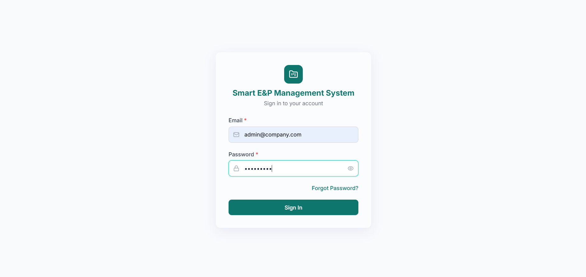

## email verification

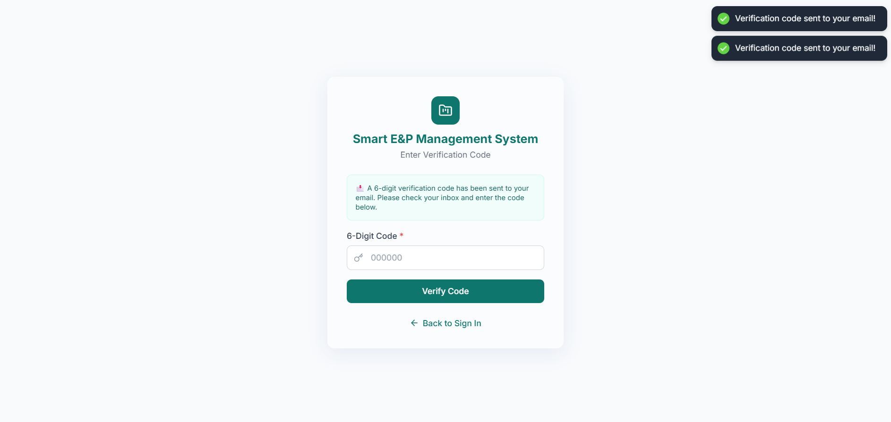

## Admin dashboard 

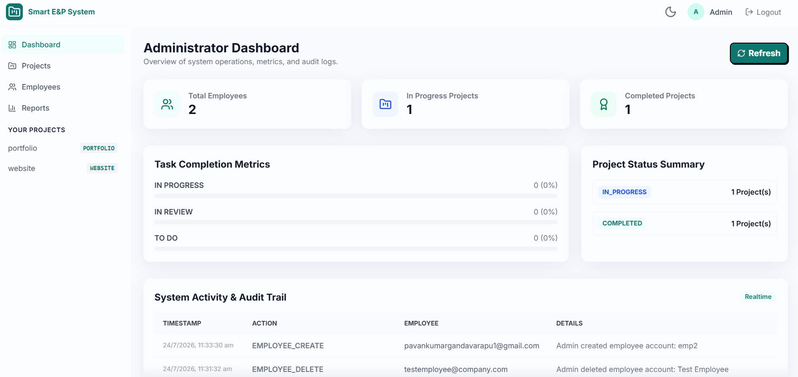

## Admin dashboard night mode

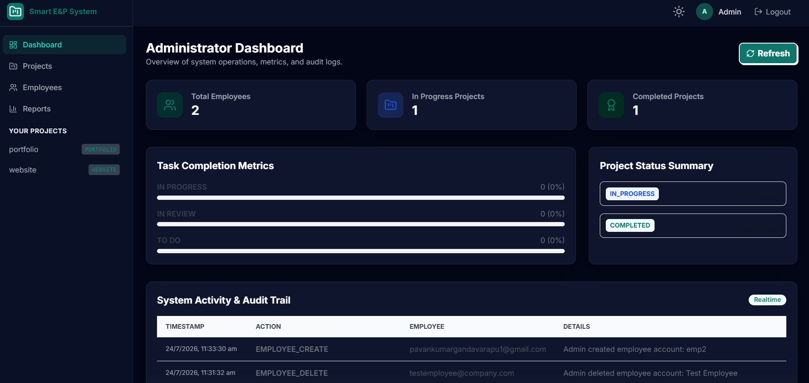

## employees in admin dashboard

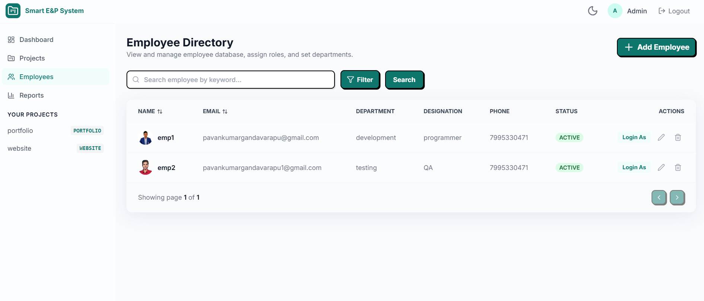

## projects in admin portal

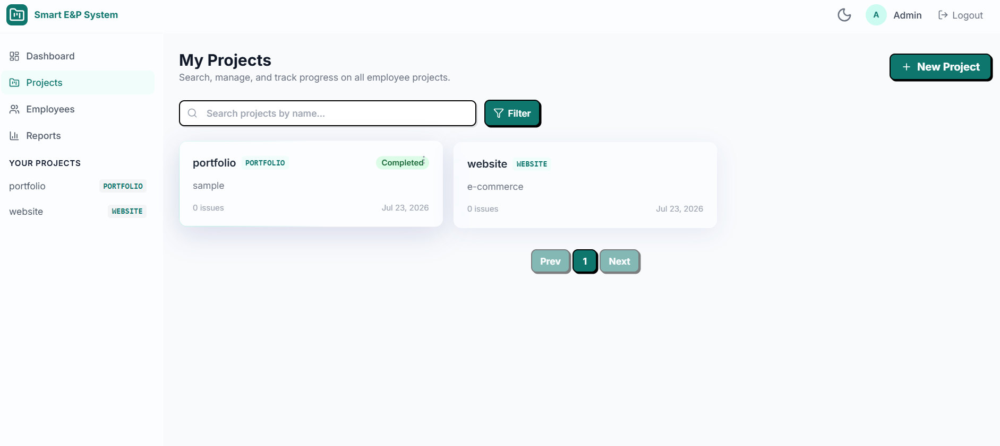

## reports in admin portal

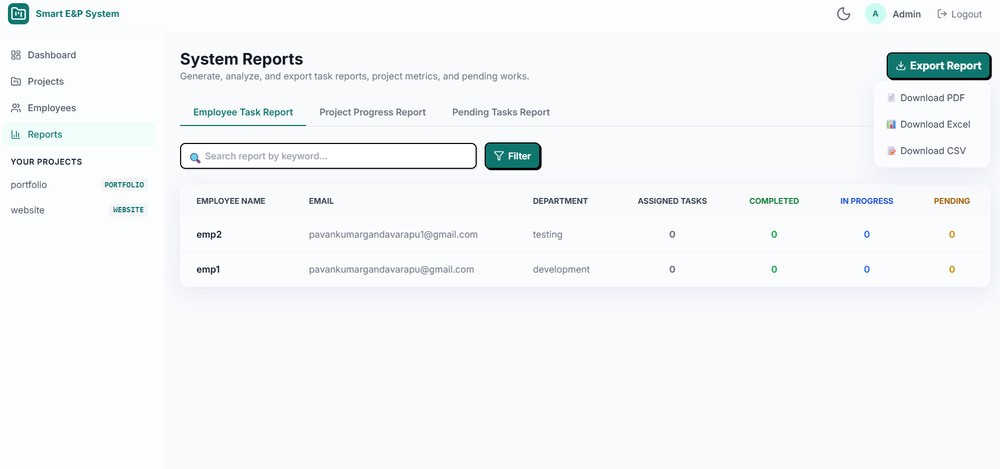

## project creation 

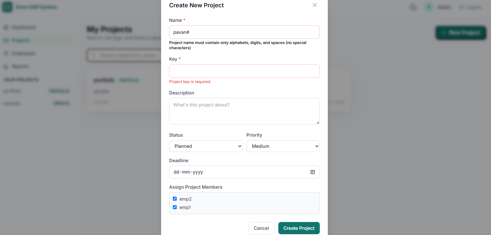

## Employee dashboard

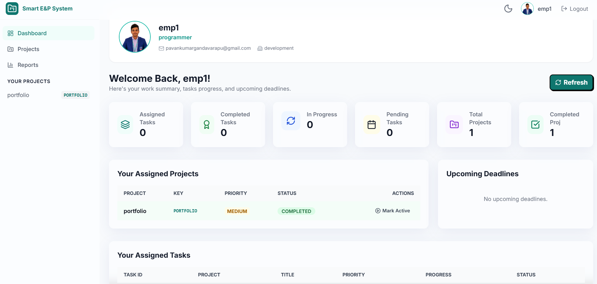

## employee projects

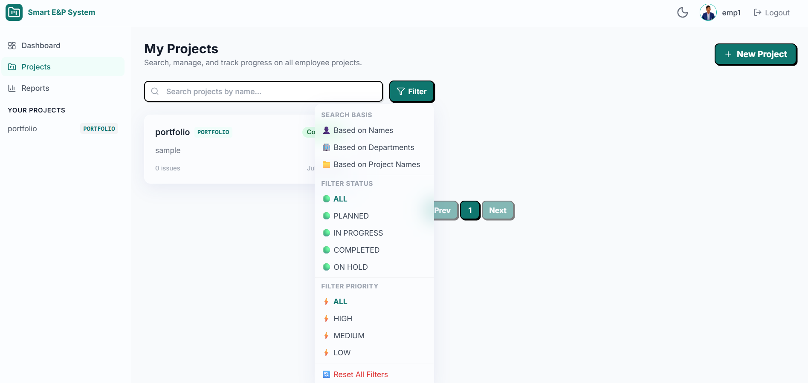

## employee creation

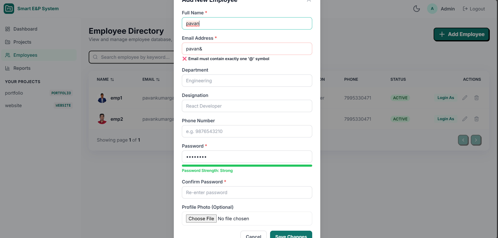

## Impersonation
  Admin can act as an employee to know the project status incase of employee unavailability.

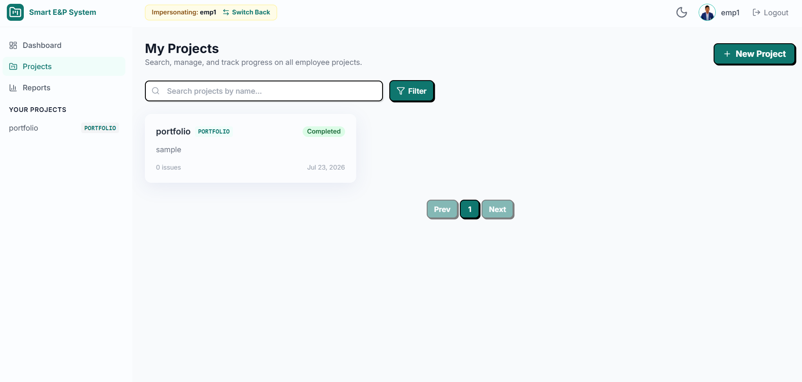


--------------------------------------------------------------------------------------------------------------


# 9. 📊 System Architecture 

      The diagram below represents the complete end-to-end flow of authentication, employee directory management, project structures, drag-and-drop tasks, API endpoint routes, and MySQL database writes:

      
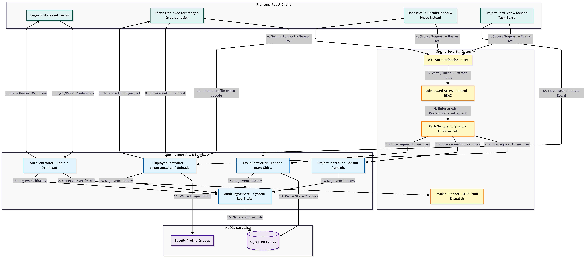


# 9.1 Database Entity Relationship (ER) Diagram


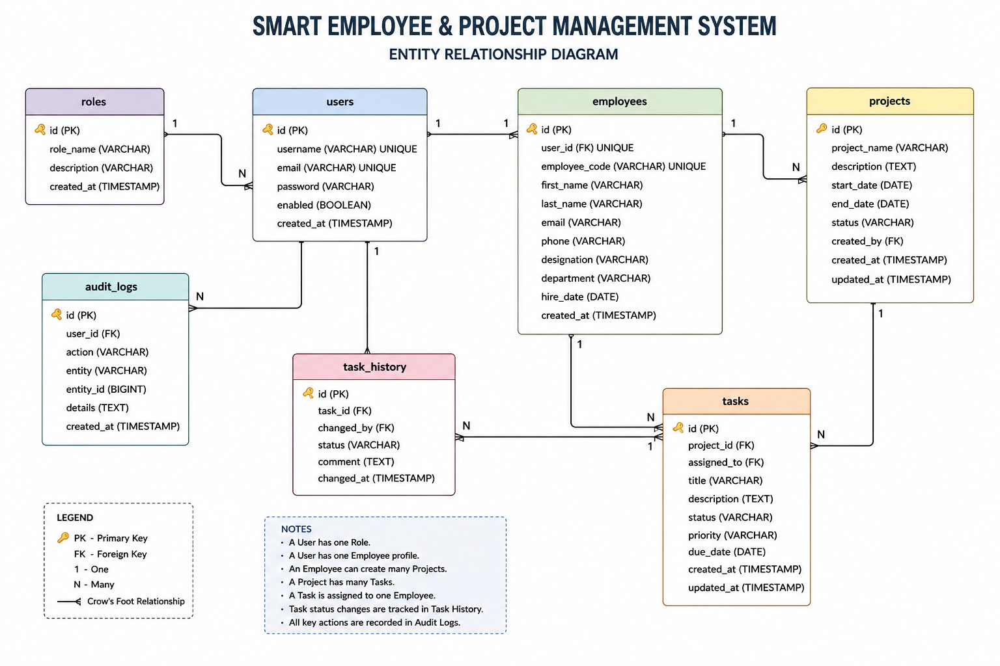


# 9.2 Authentication & Authorization flowchart

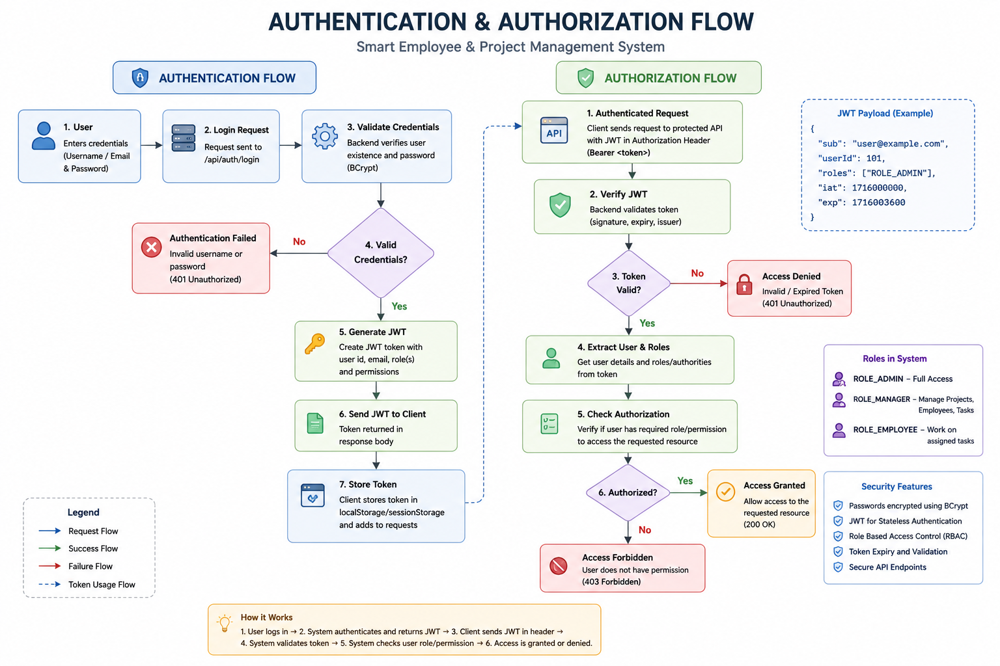


# 9.3 Employee and project management flowchart

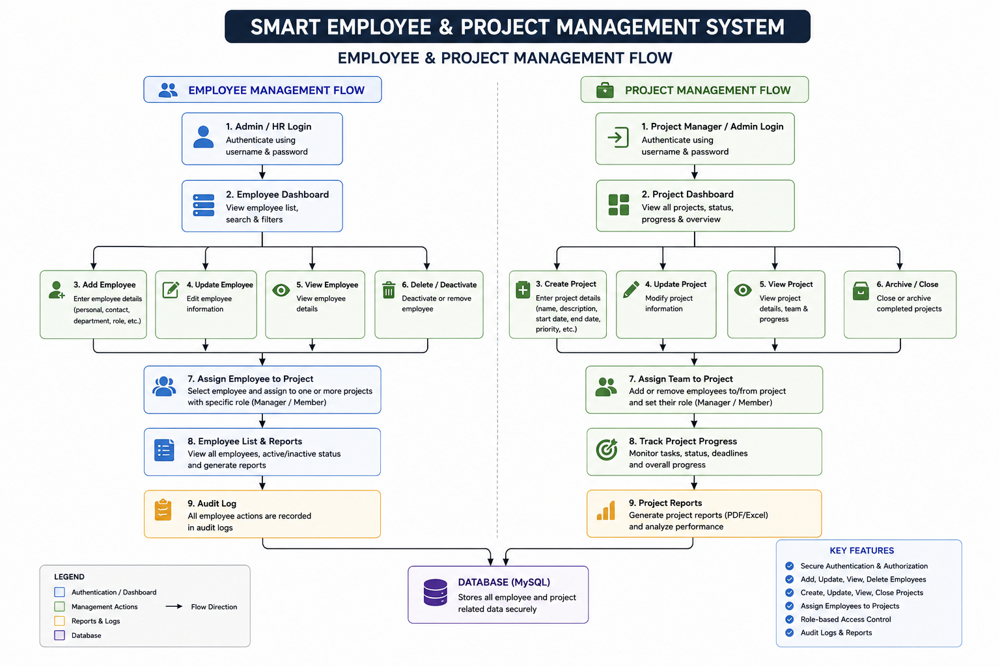


--------------------------------------------------------------------------------------------------------------


# 10. Flow chart
```

                      Smart Employee & Project Management System

                                  ┌──────────────┐
                                  │    User      │
                                  │(Admin/Employee)
                                  └──────┬───────┘
                                         │
                                         ▼
                           ┌────────────────────────┐
                           │ React Frontend (Vite)  │
                           │ Login • Dashboard      │
                           │ Projects • Tasks       │
                           │ Kanban • Reports       │
                           └──────────┬─────────────┘
                                      │ REST API
                                      ▼
                     ┌────────────────────────────────┐
                     │ Spring Boot Backend            │
                     │                                │
                     │ JWT Authentication             │
                     │ Spring Security                │
                     │ Role Authorization             │
                     └──────────┬─────────────────────┘
                                │
        ┌───────────────────────┼────────────────────────┐
        ▼                       ▼                        ▼
┌────────────────┐      ┌────────────────┐      ┌────────────────┐
│ Employee       │      │ Project        │      │ Task           │
│ Management     │      │ Management     │      │ Management     │
└────────────────┘      └────────────────┘      └────────────────┘
        │                       │                        │
        └───────────────┬───────┴───────────────┬────────┘
                        ▼                       ▼
               ┌─────────────────┐    ┌──────────────────┐
               │ Kanban Board    │    │ Reports          │
               │ Status Tracking │    │ PDF / Excel      │
               └────────┬────────┘    └────────┬─────────┘
                        │                      │
                        └──────────┬───────────┘
                                   ▼
                      ┌────────────────────────┐
                      │ Service Layer          │
                      │ Business Logic         │
                      └──────────┬─────────────┘
                                 ▼
                     ┌─────────────────────────┐
                     │ Spring Data JPA         │
                     │ Repository Layer        │
                     └──────────┬──────────────┘
                                ▼
                     ┌─────────────────────────┐
                     │ MySQL Database          │
                     │ Users                   │
                     │ Employees               │
                     │ Projects                │
                     │ Tasks                   │
                     │ Audit Logs              │
                     └─────────────────────────┘

```


--------------------------------------------------------------------------------------------------------------

# 11. Folder structure
```
Smart_Employee_and_Project_Management_System/
│── README.md
│── database/
│   └── schema.sql
│── postman/
│   └── Smart_Employee_Project_API.postman_collection.json
│── frontend    // folder contains frontend
|── smartep     // folder contains backend
│── System_Architecture.pdf
│── ER_Diagram.png
│── Authentication_Flowchart.png
│── Employee_Project_Flowchart.png
│── assets/
│   ├── login.png
│   ├── email-verification.png
│   ├── admin-dashboard.png
│   ├── admin-dashboard-dark.png
│   ├── employees.png
│   ├── projects.png
│   ├── reports.png
│   ├── project-creation.png
│   ├── employee-dashboard.png
│   ├── employee-projects.png
│   ├── employee-creation.png
│   └── impersonation.png
|── docker-compose.yml


```

--------------------------------------------------------------------------------------------------------------


# 12. 💾 Database Script (`schema.sql`)

This is the schema definition script mapping MySQL tables, relationships, and constraints:


                  


--------------------------------------------------------------------------------------------------------------


# 13. 📬 Postman Collection

This is the script that describes the entire postman collection

                  


--------------------------------------------------------------------------------------------------------------


# 14. 📖 Interactive API Documentation
The application includes fully integrated Swagger UI and OpenAPI 3.0 documentation to simplify API testing and integration. Developers can interactively query and validate all security, employee, project, and task endpoints directly from their web browser. This documentation is automatically generated by Springdoc and is accessible locally when the backend server is running.

Swagger UI Portal: 🔗 http://localhost:8080/swagger-ui/index.html
OpenAPI Raw Specification (JSON): 🔗 http://localhost:8080/v3/api-docs


---------------------------------------------------------------------------------------------------------------

# 15. Submission & Author Info

Submission Context: Developed for EverNorth Technical Assessment (Round 2).
Author: Gandavarapu Pavan Kumar
Date: July 2026
License: MIT License
